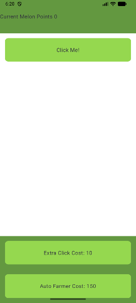

# Clicker Adventure

## Goal (What am I?)
The game is a mashup between Cookie Clicker, Venture Capitalist and Candy Crush
You start as a random person making products by clicking away, you can hire employees, automate tasks and build a clicker empire

The way it's similar to Candy Crush is that there are many biomes that have levels, each level has a specific requirement weather that's reaching a certain number of clicks or achieving the last automated machine

## Goal (What for?)

This is a boredom killer game as well as a dopamine inducer. It's meant as a small distraction from real world elements and just to have fun.
An app like this is targeted towards people who enjoy completing a goal with minimal effort

## Quick-start
How to install and launch your application:
- Clone the repository from GitHub.
- Open the project in Android Studio.
- Sync Gradle and run the app on an Android emulator or physical device (minimum SDK 24, target SDK 33).

## Screenshots of application
- Main Game Screen
- Inventory & Equipment Screen

## Team members
- William D Fraser
- Sarah Soucy
